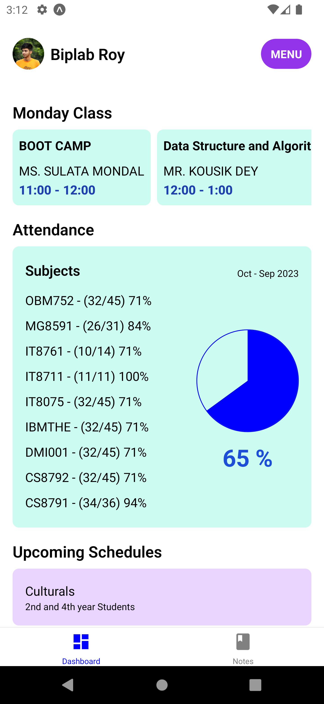

# StudentLink

StudentLink is an innovative app designed to enhance the self-service capabilities and user experience for students at Brainware University.

## Features

- **Intuitive Interface**: User-friendly design for easy navigation and accessibility.
- **Comprehensive Services**: Access to campus resources including course schedules, library services, and administrative functions.
- **Personalization**: Customize settings to personalize your experience and receive relevant updates.
- **Real-time Notifications**: Stay informed with instant alerts on important deadlines, events, and announcements.

## Screenshots

<div style="display: inline-block;">
    
    
</div>

<div style="display: inline-block;">
    
    
</div>

<div style="display: inline-block;">
    
    
</div>

<div style="display: inline-block;">
    
    <!-- Add another image here if needed -->
</div>


## Getting Started

To get started with StudentLink, follow these steps:

1. **Clone the repository**:
   ```
   git clone https://github.com/biplabroy-1/StudentLink.git
   cd studentlink 
   ```
1. **Install Package**: 

    ```
    npm install
    // Use Bun
    bun install
    ```
1. **Start the app**:
    ```
    npm start
    // Use Bun
    bun start

1. **Open the app**:
Open your web browser and navigate to http://localhost:3000 (or the specified port).


# Feedback
 
- Your feedback is valuable! If you encounter any issues or have suggestions for improvement, please contact us at biplabr119201@gmail.com

## Contributors

- Biplab Roy [Linked In](https://www.linkedin.com/in/biplabroy0/)


License
This project is licensed under the [MIT License.]()
